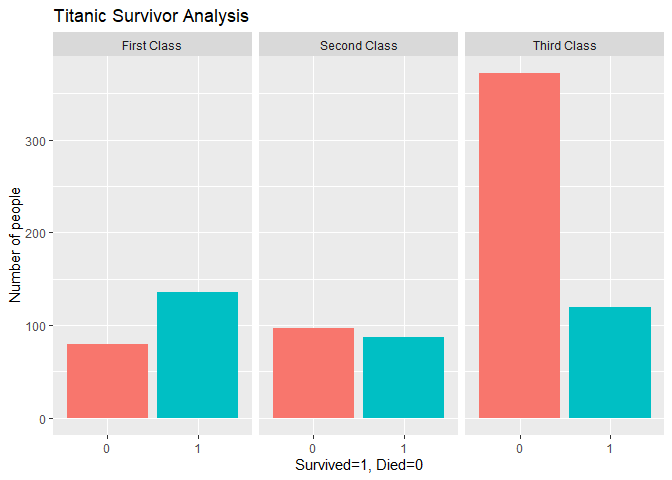
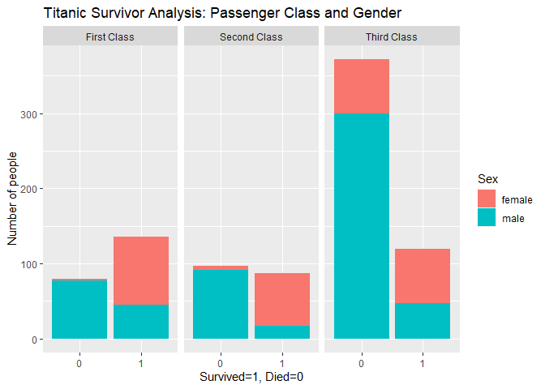
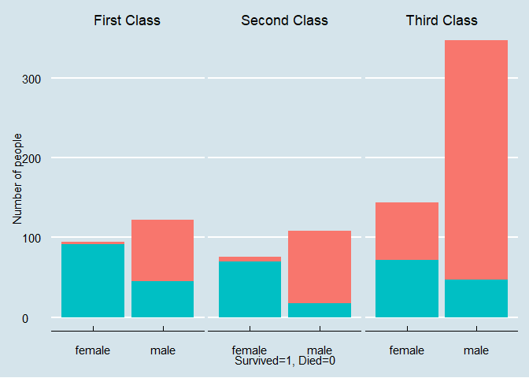
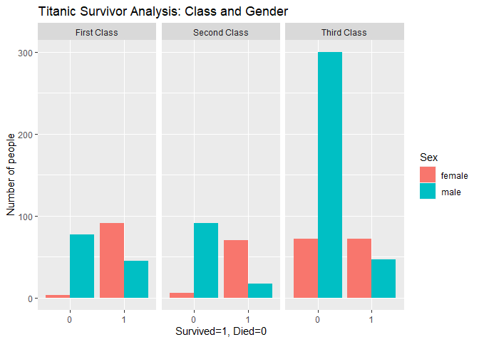

titanic survivor chances
================
Huma Abid
2023-10-09

## R Markdown

This is an analysis of the Titanic data taken from Kaggle. I use
visualisation techniques to see how different demographics affected the
passengers’ rate of survival.

## Extracting the data

``` r
library('tidyverse')
```

    ## ── Attaching core tidyverse packages ──────────────────────── tidyverse 2.0.0 ──
    ## ✔ dplyr     1.1.2     ✔ readr     2.1.4
    ## ✔ forcats   1.0.0     ✔ stringr   1.5.0
    ## ✔ ggplot2   3.4.2     ✔ tibble    3.2.1
    ## ✔ lubridate 1.9.2     ✔ tidyr     1.3.0
    ## ✔ purrr     1.0.1     
    ## ── Conflicts ────────────────────────────────────────── tidyverse_conflicts() ──
    ## ✖ dplyr::filter() masks stats::filter()
    ## ✖ dplyr::lag()    masks stats::lag()
    ## ℹ Use the conflicted package (<http://conflicted.r-lib.org/>) to force all conflicts to become errors

``` r
library('readr')
library('readxl')
library('dplyr')
library('ggplot2')
library('ggthemes')
library(hrbrthemes)
```

    ## NOTE: Either Arial Narrow or Roboto Condensed fonts are required to use these themes.
    ##       Please use hrbrthemes::import_roboto_condensed() to install Roboto Condensed and
    ##       if Arial Narrow is not on your system, please see https://bit.ly/arialnarrow

``` r
library('tinytex')
train = read.csv("C:/Users/humaa/first folder/Desktop/Kaggle/titanic/train.csv")
test = read.csv("C:/Users/humaa/first folder/Desktop/Kaggle/titanic/test.csv")
gender = read.csv("C:/Users/humaa/first folder/Desktop/Kaggle/titanic/gender_submission.csv")
```

## Overview of the Data

We run some simple commands to understand the structure of our data

``` r
head(train)
```

    ##   PassengerId Survived Pclass
    ## 1           1        0      3
    ## 2           2        1      1
    ## 3           3        1      3
    ## 4           4        1      1
    ## 5           5        0      3
    ## 6           6        0      3
    ##                                                  Name    Sex Age SibSp Parch
    ## 1                             Braund, Mr. Owen Harris   male  22     1     0
    ## 2 Cumings, Mrs. John Bradley (Florence Briggs Thayer) female  38     1     0
    ## 3                              Heikkinen, Miss. Laina female  26     0     0
    ## 4        Futrelle, Mrs. Jacques Heath (Lily May Peel) female  35     1     0
    ## 5                            Allen, Mr. William Henry   male  35     0     0
    ## 6                                    Moran, Mr. James   male  NA     0     0
    ##             Ticket    Fare Cabin Embarked
    ## 1        A/5 21171  7.2500              S
    ## 2         PC 17599 71.2833   C85        C
    ## 3 STON/O2. 3101282  7.9250              S
    ## 4           113803 53.1000  C123        S
    ## 5           373450  8.0500              S
    ## 6           330877  8.4583              Q

``` r
colnames(train)
```

    ##  [1] "PassengerId" "Survived"    "Pclass"      "Name"        "Sex"        
    ##  [6] "Age"         "SibSp"       "Parch"       "Ticket"      "Fare"       
    ## [11] "Cabin"       "Embarked"

## Analysing Data

First, we take a look at the number of survivors in each passenger
class.

``` r
ggplot(data=train) + geom_bar(mapping =  aes(x = as.factor(Survived), fill = as.factor(Survived)), show.legend = F) + facet_wrap(vars(Pclass) , labeller = as_labeller(c('1'='First Class','2'='Second Class','3'='Third Class')) ) + labs(x='Survived=1, Died=0', y = 'Number of people') + ggtitle('Titanic Survivor Analysis')
```

<!-- --> As
evident from the graph, there are dispropotionate deaths in the Third
Class which inidicates that passenger class may be a determining factor
in the survival rate.

Next, we check if there is an interaction between Gender and Passenger
Class.

``` r
ggplot(data=train) + geom_bar(mapping =  aes(x = as.factor(Survived), fill = Sex )) + facet_wrap(vars(Pclass), labeller = as_labeller(c('1'='First Class','2'='Second Class','3'='Third Class')) ) + labs(x='Survived=1, Died=0', y = 'Number of people')  + ggtitle('Titanic Survivor Analysis: Passenger Class and Gender')
```

<!-- --> The
plot shows that men were more likely to die across all classes.

Next, we check if the above discrepancy simply refelcted the fact that
there were more men on board. In the next graph we check both variables
together. The graph shows the number of male and female passengers for
both categories: ‘Survived and Died’

``` r
ggplot(data=train) + geom_bar(mapping =  aes(x=Sex, fill = as.factor(Survived)), show.legend = F)+ facet_wrap(vars(Pclass), labeller = as_labeller(c('1'='First Class','2'='Second Class','3'='Third Class')) ) + labs(x='Survived=1, Died=0', y = 'Number of people') + theme_economist() + scale_color_economist(name = NULL)
```

<!-- -->

``` r
ggplot( data=train) + geom_bar(mapping =  aes(x = as.factor(Survived), fill = Sex ), position = 'dodge') + facet_wrap(vars(Pclass), labeller = as_labeller(c('1'='First Class','2'='Second Class','3'='Third Class')) ) + labs(x='Survived=1, Died=0', y = 'Number of people') + ggtitle('Titanic Survivor Analysis: Class and Gender') 
```

<!-- -->
